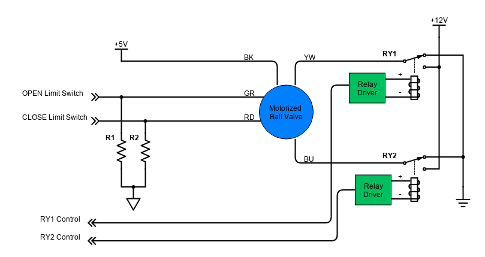

# ArduinoCloudValveCtrl

Implement a valve controller with a ESP8266 WIFI, and Arduino Cloud

## Hardware 

[8 Channel 5V Relay Module](http://wiki.sunfounder.cc/index.php?title=8_Channel_5V_Relay_Module)

[Relay Datasheet](https://www.circuitbasics.com/wp-content/uploads/2015/11/SRD-05VDC-SL-C-Datasheet.pdf)

[Ks0354 Keyestudio ESP8266 WI-FI Development Board](https://wiki.keyestudio.com/Ks0354_Keyestudio_ESP8266_WI-FI_Development_Board)

[US Solid - Motorized Ball valve](https://ussolid.com/content/JFMSV/JFMSV-User-manual.pdf)

[Ks0252 keyestudio Proto Screw Shield for Arduino](https://wiki.keyestudio.com/Ks0252_keyestudio_Proto_Screw_Shield_for_Arduino)

## Arduino Cloud

Setup based on documentation [Arduino Nano ESP32 IoT Cloud Setup Guide](https://docs.arduino.cc/tutorials/nano-esp32/cloud-setup)

Needs to install: [ArduinoIoTCloud library](https://www.arduino.cc/reference/en/libraries/arduinoiotcloud/)

In "Set device flavours" use default but change "Reset Method".

```text
Generic ESP8266 Module flavours
Upload Speed: 115200
CPU Frequency: 80 MHz
Crystal Frequency: 26 MHz
Flash Size: 512K (no SPIFFS)
Flash Mode: DOUT (compatible)
Flash Frequency: 40MHz
**Reset Method: nodemcu**
Debug port: Disabled
Debug Level: None
lwIP Variant: v2 Lower Memory
VTables: Flash
Exceptions: Disabled
Builtin Led: 2
Erase Flash: Only Sketch
```

## Board support

https://forum.arduino.cc/t/errors-compiling-arduinoiotcloud-examples/877136

Needs to use : esp8266 by ESP8266 version 2.5.0

Select board : NodeMCU 1.0 (ESP-12E Module) (esp8266)

## Software develop setup

Google test implemented to run unit test on firmware components.

### CMake

`sudo apt  install cmake`

### PlantUML

Install JAVA:

```bash
sudo apt-get update`
sudo apt-get install default-jre
```

Get PlantUML jar file 

`wget https://netcologne.dl.sourceforge.net/project/plantuml/plantuml.jar`

Create a Shell Script:

```bash
#!/bin/bash
java -jar /path/to/plantuml.jar "$@"
```

Save the file, make it executable with chmod +x plantuml, and move it to a directory in your PATH (e.g., /usr/local/bin).

## Running tests

Only one target named **tests**.

```bash
mkdir build
cd build
cmake ..
cmake --build . 
./tests/tests
```

## Schematic

Realized with [DigiKey - Scheme-it](https://www.digikey.com/en/schemeit/project)



### Valve power control

By default valves are de-energized

| RY2 | RY1 | Motorized ball valve | YW - BU |
| --- | --- |  ---                 | ---     |
| 0   | 0   | motionless           |  0V     |
| 0   | 1   | open                 |  12V    |
| 1   | 0   | close                | -12V    |
| 1   | 1   | motionless           |  0V     |

### Valves inputs

| Motorized ball valve | Open limit switch | Close limit switch |
| ---                  | ---               | ---                |
| open                 | 0                 | 0                  |
| fully open           | 1                 | 0                  |
| fully close          | 0                 | 1                  |
| error                | 1                 | 1                  |

